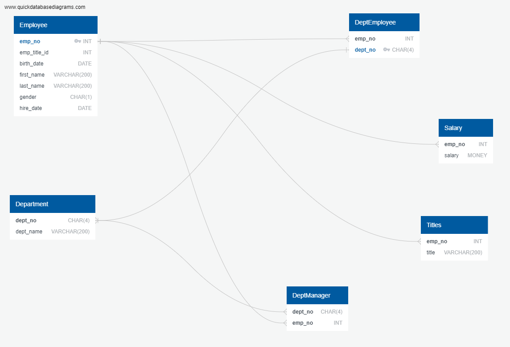

# SQL-challenge


## Steps generated before starting

- Create a new repository for this project called sql-challenge.

- Clone the new repository to my computer.

- Inside my local Git repository, create a directory for this challenge. I used a folder name that corresponds to the challenge: EmployeeSQL.

- I pushed the changes to GitHub.

## Installation

In order to run the .sql files you need to have pgAdmin4 installed, below is the detail to install it:

- Download

Maintainer: pgAdmin Development Team

pgAdmin is available for 64 bit Windows™ 7 SP1 (desktop) or 2008R2 (server) and above, up to v4.30.

v5.0 and later are supported on Windows 8 (desktop) or 2012 (server) and above.

v7.0 and later are supported on Windows 10 (desktop) or 2016 (server) and above.

32 bit Windows support is available for versions up to v4.29.

The packages below include both the Desktop Runtime and Web Application:

```bash
https://www.pgadmin.org/download/ 
```
- Info

Nightly snapshot builds generated from the head of the master branch are available here.

To install these packages, simply download and run the installer.

The Windows installers are signed with a Microsoft-issued digital signing key.

## Task done

This Challenge was divided into three parts: data modeling, data engineering and data analysis.

- Data modeling

An entity relationship diagram is included or table schemas are provided for all tables.

- Data engineering

All required columns are defined for each table.
The columns are set to the correct data type.
Primary keys established for each table.
I correctly referenced related tables.
The tables are correctly related using foreign keys.
I correctly used the NOT NULL condition on the necessary columns.
I precisely defined the length of the columns value.

-  Analysis of data

I indicated the employee number, last name, first name, gender and salary of each employee.
I indicated the first name, last name, and date of hire of the employees who were hired in 1986.
I listed the manager of each department along with their department number, department name, employee number, last name, and first name.
I listed each employee's department number along with that employee's employee number, last name, first name, and department name.
I indicated the first name, last name, and gender of each employee whose name is Hercules and whose last name begins with the letter B.
I listed each employee in the Sales department, including their employee number, last name, and first name.
I listed each employee in the Sales and Development departments, including their employee number, last name, first name, and department name.
I listed the frequency counts, in descending order, of all employee surnames.

## Screenshots





## Submission

- Create an image file of your ERD.

- Create a .sql file of your table schemata.

- Create a .sql file of your queries.

- Create and upload a repository with the files to GitHub. As well as the README file.


## References

- https://www.quickdatabasediagrams.com/

- https://en.wikipedia.org/wiki/Composite_key

- https://www.sqlalchemy.org/

- https://git.bootcampcontent.com/University-of-Adelaide/UADEL-VIRT-DATA-PT-12-2023-U-LOLC

- https://www.enterprisedb.com/software-downloads-postgres


